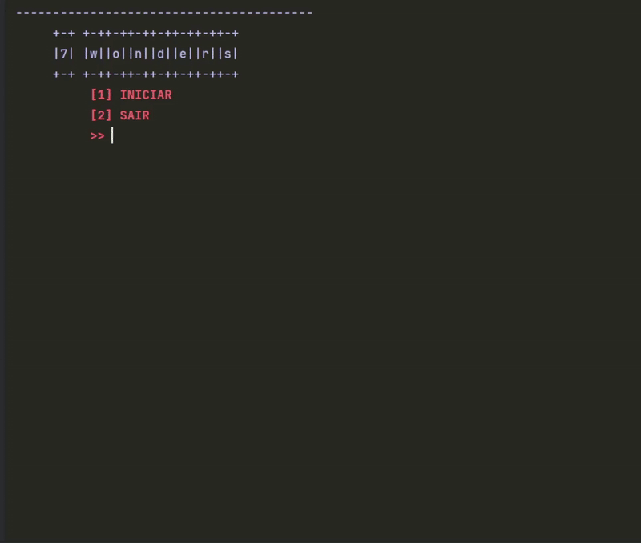
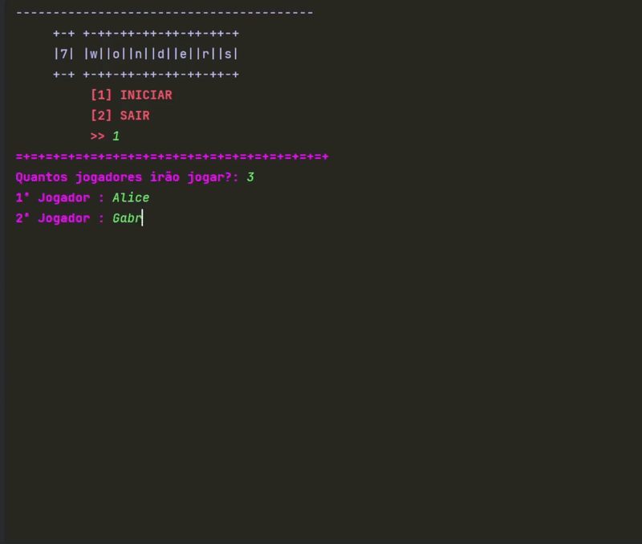

# 🎲 7 Wonders Map & Ship Randomizer

A Python script to **randomly select maps and ships** for the **7 Wonders boardgame**, including the base game and expansions.
------------------------------------------------------------------------------------------------------------------------------
<p align="center">
  
  
  
</p>


## 📦 Requirements
- Python 3.10 or higher  
- [colorama](https://pypi.org/project/colorama/) library  

```bash
---------- Colorama Installation ----------
# NOTE: You can run these commands either in your system terminal
# (Windows, Mac, Linux) or in the Python console (e.g., PyCharm).  

# ----- Windows -----
pip install colorama
# or, to ensure the correct pip is used:
python -m pip install colorama

# ----- Mac -----
# If using Homebrew to manage Python:
brew install python   # only if Python 3 is not installed
python3 -m pip install colorama

# ----- Linux (Ubuntu/Debian) -----
sudo apt update
sudo apt install python3-pip  # only if pip is missing
python3 -m pip install colorama

# ----- Conda (optional) -----
# Works on any system with Anaconda/Miniconda installed:
conda install -c conda-forge colorama

# ----- Via .whl file (optional, rare) -----
# 1. Download the .whl file matching your Python version and OS
# 2. Install with:
# pip install path/to/file.whl
 ```
2. **Download Game**  
 ```bash
git clone https://github.com/SEU-USUARIO/7-wonders-randomizer.git
cd 7-wonders-randomizer
 ```
3. **Run the Game**
```bash
Run the script
python principal.py
 ```
