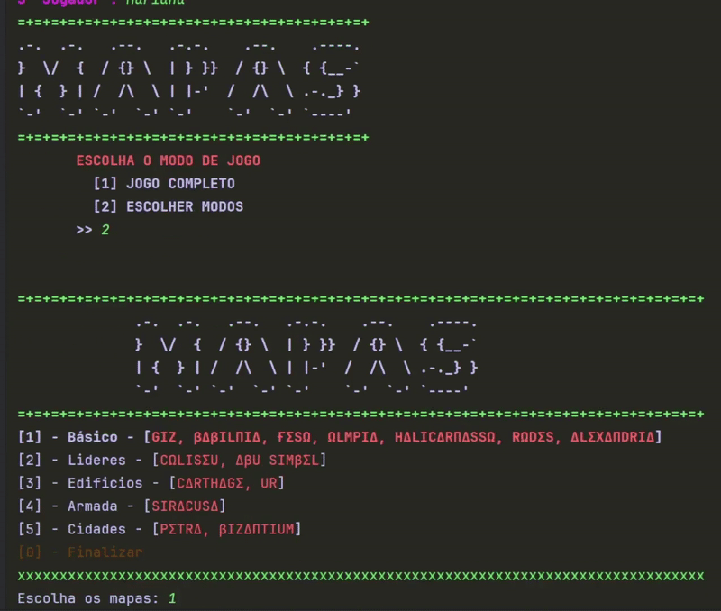

# 🎲 7 Wonders Map & Ship Randomizer

A Python script to **randomly select maps and ships** for the **7 Wonders boardgame**, including the base game and expansions.
------------------------------------------------------------------------------------------------------------------------------
<p align="center">
  
  
  
</p>


## 📦 Requirements
- Python 3.10 or higher  
- [colorama](https://pypi.org/project/colorama/) library  

```bash
# Install colorama
pip install colorama
# or, to ensure correct pip is used:
python -m pip install colorama

🚀 How to Run
Download the project

bash
Copiar
Editar
git clone https://github.com/SEU-USUARIO/7-wonders-randomizer.git
cd 7-wonders-randomizer
Run the script

bash
Copiar
Editar
python principal.py
